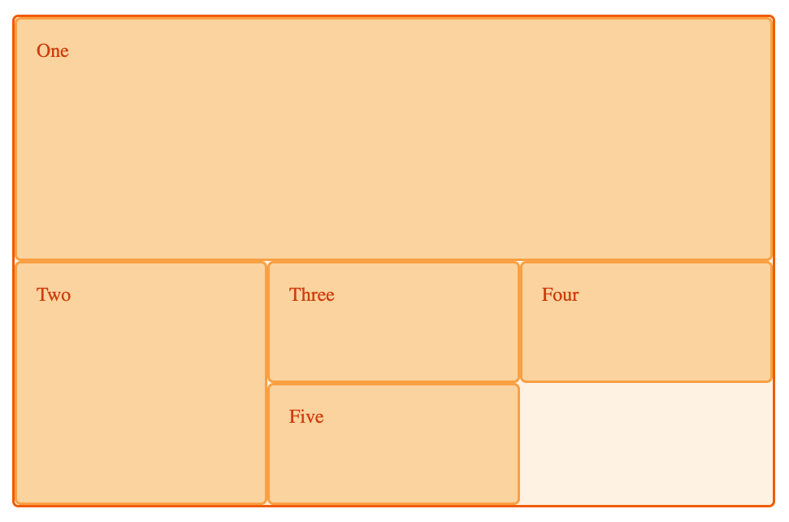

## CSS Flexible Box Layout
- CSS Flexible Box Layout is a module of CSS. It's used for UIs to layout a set of items in any direction. The children of a flex container can "flex" their sizes, growing to fill unused space or shrinking to avoid overflowing the parent. 
- When you set a container to `display: flex`, its children become flex items. 

- The more the merrier: [A Complete Guide to Flexbox](https://css-tricks.com/snippets/css/a-guide-to-flexbox/)

### Background
- The flexbox layout is direction-agnostic as opposed to the regular layouts (block which is vertically-based and inline which is horizontally-based). While those work well for pages, they lack flexibility (no pun intended) to support large or complex applications (especially when it comes to orientation changing, resizing, stretching, shrinking, etc.).
- Flexbox layout is most appropriate to the components of an application, and small-scale layouts, while the Grid layout is intended for larger scale layouts. [A Complete Guide to Grid](https://css-tricks.com/snippets/css/complete-guide-grid/).

### Flexbox
- To create a flex container, set the value of the area's container's `display` property to `flex` or `inline-flex`.
- Items are laid out on either the `main axis` or the `cross axis`. The main axis is the primary axis, but it isn't necessarily horizontal. Its orientation is determined by the `flex-direction` property.
- The main axis and cross axis are derived from `flex-direction` and can be `row` or `column`. A flexbox only ever deals with a layout in 1D, either as a row or column (the CSS Grid Layout is 2D). 
- The direct children of that container become flex items. Some initial values are defined:
	- Items display in a row (the `flex-direction` property's default is `row`)
 	- The items start from the start edge of the main axis.
 	- The items do not stretch on the main dimension, but can shrink.
 	- The items will stretch to fill the size of the cross axis.
 	- The `flex-basis` property is set to `auto`.
 	- The `flex-wrap` property is set to `nowrap`. If the items are too large to fit on a line, they will shrink to fit the container. 
- A flex container is filled from its **start** to its **end** with items. 
- If you are working in English, the start edge will be on the left and the end edge on the right. If you're working in Arabic/Japanese, it will be the reverse.

#### Properties

##### Cross Axis Properties
- Properties: `align-items` & `align-self` control the alignment of flex items on the cross axis. 
	- `align-items` sets the `align-self` property of all the flex items in the container. 
	- To align a single flex item, use `align-self`.
	- `align-content` controls the distribution of space _between_ the rows/columns along the cross axis. Aka [packing flex lines](https://drafts.csswg.org/css-flexbox/#align-content-property).

##### Main Axis Properties
- The main axis uses only one property for alignment, `justify-content`, and deals with all the items as a group, managing both the items and the empty space.

#### `flex-flow` Shorthand Property
- `flex-flow` = `flex-direction` + `flex-wrap`
- e.g. `row wrap`:
```javascript
.box {
	display: flex;
	flex-flow: row wrap; 
}
```

#### Properties applied to flex items
- By default, leftover available space will be placed after the last item in the flexbox (at the `end`). 
- 3 `flex` properties can be applied to cause items to resize to fill the available space:
1. `flex-grow`: 
	- When `flex-grow` is set to a positive integer, flex items can grow along the main axis from their `flex-basis`. They will stretch to take up any available space. If other items are also allowed to grow, they will stretch by a proportion of the available space. 
	- `flex-grow` can be used to distribute space in proportion. Each item has a `flex-basis` and `flex-grow` property, and so if there were 2 objects, with a `flex-grow` ratio of 2:1, object A: object B, object A will get 2 parts of the available space and object B will get 1 part. Both will grow if space becomes available.  
2. `flex-shrink`: When `flex-shrink` is set to a positive integer, the item can become smaller than their `flex-basis`. Similar to `flex-grow`, can be used to distribute space in proportion to different items. 
3. `flex-basis`: Defines the size of an item. By default the value is `auto`, in which case the browser looks to see if the items in the container have a size, which is used for the `flex-basis`. If the items don't have a size, the content's size is used as the `flex-basis`.
	- Options: An absolute `<length>`, a `<percentage>` of the parent flex container's main size property, or the keyword `auto`. Negative values are invalid. Defaults to `auto`. 

##### `flex` shorthand
- The 3 properties are combined into the `flex` shorthand, in the order: `flex-grow > flex-shrink > flex.basis`, e.g. `1 1 auto` to have the item both grow and shrink, its `flex.basis` set to `auto`. 
- There are predefined shorthand values to cover most use cases: 
	- `flex: initial`: same as `flex: 0 1 auto`. `flex-grow` is 0, `flex-shrink` is 1, and `flex-basis` is auto. Items can shrink if they need to rather than overflowing, but won't grow.
	- `flex: auto`: same as `flex: 1 1 auto`. Items will both grow and shrink. 
	- `flex: none`: Fully inflexible items, same as `flex 0 0 auto`. 
	- `flex: <positive number>`: Equivalent to `flex: <positive-number> 1 0`

## CSS Grid Layout
- A grid is a set of intersecting horizontal and vertical lines which make up columns and rows. Elements can be placed on the grid. 
- Grids have the following features: 
	- Fixed or flexible track sizes --> track sizes can be set using pixel size, %s, or the `fr` unit
	- Item placement: You can place items at precise locations in the grid using line numbers, names, or by targeting an area of the grid. Grid also has an algorithm to control the placement of items not given explicit position on the grid. 
	- Creation of additional tracks to hold content: Features such as adding "as many columns that will fit into a container" are included.
	- Alignment control

### Grid Tracks
- Rows and columns are defined with the `grid-template-columns` and `grid-template-rows` properties. These define grid tracks. A **grid track** is the space between any two lines on the grid.

### The `fr` unit
- The new `fr` unit represents a fraction of the available space in the grid container. To create a grid with 2 equal width tracks: 

```html
<div class="wrapper">
  <div>One</div>
  <div>Two</div>
  <div>Three</div>
  <div>Four</div>
  <div>Five</div>
</div>
```

```css
.wrapper {
  display: grid;
  grid-template-columns: 1fr 1fr 1fr;
}
```

### `repeat()` notation
To handle an arbitrary number of tracks, use the `repeat()` notation: 

```css
.wrapper {
  display: grid;
  grid-template-columns: repeat(3, 1fr); // same as `1fr 1fr 1fr`
}
```

### Track height - `grid-auto-rows` and `grid-auto-columns`
- We can define a set size for tracks in the implicit grid with the `grid-auto-rows` and `grid-auto-columns` properties. 
- We can use the `minmax()` function if we want a min and max height. For example, here is how to have the rows be a min of 100px in height but stretch up to the available space: 

```css
.wrapper {
  display: grid;
  grid-template-columns: repeat(3, 1fr);
  grid-auto-rows: minmax(100px, auto);
}
```

### Positioning items against grid lines
- We explicitly define the grid tracks, and then grid lines are created with numbered positions. In a 3-column, 2-row grid you will have 4 column lines and 3 row lines. 
- We can place items on the grid by targeting specific lines using the `grid-column-start`, `grid-column-end`, `grid-row-start` and `grid-row-end` properties. 
- Here is an example: 

#### html:
```html
<div class="wrapper">
  <div class="box1">One</div>
  <div class="box2">Two</div>
  <div class="box3">Three</div>
  <div class="box4">Four</div>
  <div class="box5">Five</div>
</div>
```

#### css:
```css
.wrapper { 
  display: grid; 
  grid-template-columns: repeat(3, 1fr); 
  grid-auto-rows: 100px; 
} 

.box1 { 
  grid-column-start: 1; 
  grid-column-end: 4; 
  grid-row-start: 1; 
  grid-row-end: 3; 
}

.box2 { 
  grid-column-start: 1; 
  grid-row-start: 3; 
  grid-row-end: 5; 
}
```



### Grid cells and grid areas
- The smallest unit is the grid cell. Multiple grid cells can make up a grid area, but it must be a rectangle. 

### Gutters
- Gutters (aka alleys) can be created between grid cells using the `column-gap` and `row-gap` properties. 

### Nesting grids
- A grid item can become a grid container. You can nest a grid in another grid. 