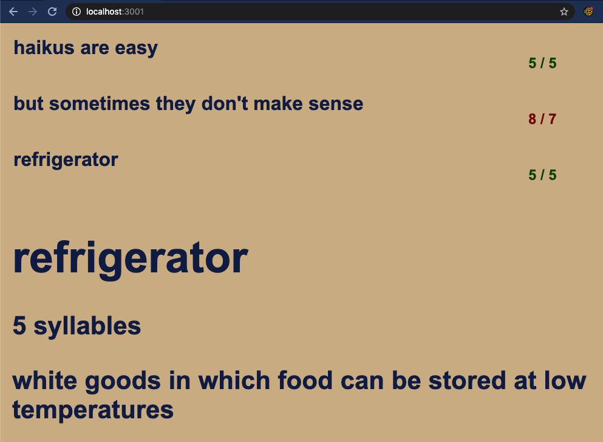

# builder 
- Here is a poem builder app with the same styling as the last app. Going to need to clean up `index.css`, but for now, this is what we have: 


- Needed to change the implementation slightly, but the look is still basically the same. Changed `<h1>`'s which are `contentEditable` to `<input>`'s, and then changed the styling of the `<input>`s to look like headings, removing the border and such. The one catch is that now the user has no idea there's an `<input>` there, but I'm thinking with some focus or adding some color contrast, I don't need that ugly shadowy generic input look:


- **Note to self**: I'm committing at the time I take each of these screenshots, so the code at the time the photo was uploaded can be referenced in the future to figure out what contributed to the styling/other UI stuff at that point in time.

## State
- Currently, state consists of:
1. `haiku` (an array of 3 lines, initialized to `null`), 
2. `lineCount`, which is set to `3` and not used. 
3. `syllableCounts`, which is an array of the syllable requirement for each of the lines.
- Instead of this, I'll pass `lineCount` and `syllableCounts` to the `Game` component from `index.js` when I mount the component, so that potentially I can have an even higher level view later on which allows users to switch between poem types. 
- I elevated some of the state of the `Game` component one level up to the `index.js` component(?). Or, I kept the state in the `Game` component, but that state is initialized based on props passed along from a higher-level component, which has not yet been written. 
- Further, I renamed the `Game` component as the `Poem` component, because I think that higher-level component above the now `Poem` component could aptly be called the `Game` component. I also changed `haiku` in the `Poem`'s state to `poem`, for more flexibility. Now, things are better equipped to handle different poem types, down the road. 
- Everything still looks the same: 


## Updating State
- When a user updates one of the lines, the state in the `Poem` component needs to be updated. Currently, a `Line` isn't a separate component, but rather a part of the `Poem` component:

```javascript
class Poem extends React.Component {
	constructor(props) {
		super(props);
		this.state = {
			lineCount: props.lineCount,
			poem: Array(props.lineCount).fill(null),
			syllableCounts: props.syllableCounts,
		};
	};
	
	handleLineUpdate(lineNumber, line) {
		console.log(`line #${lineNumber}: update the state with new line:  ${line}`);
	}
	
	render(){
		const mapping = this.state.poem.map((line, index) => <input key={index} contentEditable="true" onKeyUp={(index, line) => this.handleLineUpdate(index, line)}>{line}</input>);
		
		return (
			<div>
				{mapping}
			</div>
		);
	};

};
```

- I used the `map` function to create an array of inputs, prepopulated with the contents of each `line` in the `poem`, and also attached an `onKeyUp` event handler to invoke `this.handleLineUpdate(index,line)`, so that I can update the state whenever a line is updated. It's not yet clear to me why I would need to go another level down and add a `Line` component, but I suppose I could add a `Lines` component, which takes the `poem` as props and returns the array of `<input>`'s, because later on I'll be adding more the `Poem` component and don't want it to be too cluttered. But for now, let's implement the callback.

### An interesting mystery
- I'm trying to have my `Line` component's `props` updated when the line is changed. If I include a call to `this.forceUpdate()` after invoking `this.setState({ poem: currentLines });`, then I see the changes in the `Line` component. Otherwise, the function components (the mapping of `Line`s) aren't re-rerendered. In fact, the entire `render` method isn't called again, although I **do** see an update in the `Poem`'s state. Very weird. 
- Mystery solved! I was using the wrong syntax for `this.setState`. I was doing `this.setState = {poem: currentLines}`, instead of `this.setState({poem: currentLines})`.

### Refactored to have "persistent" state
- `Poem` component is given the props `lineCount=3`, and `syllableCounts=[5,7,5]`, and maintains all of the state. This includes `poem`, which is given an initial length of `lineCount`. 
- The `Poem`'s render method returns a `Lines` component. A `Lines` component takes the `poem` array and `handleLineUpdate`  function from the `Poem` component and maps the lines of the `poem` to `Line` components. Each `Line` component will be created with an `onChange` event handler which will invoke the `handleLineUpdate` function from the parent `Poem` component. The calling `Line` component will pass `handleLineUpdate` an `index` (the line number) and the new `line`, and the `handleLineUpdate` method will handle updating state, which will trigger the `Poem` to re-render.
- Here is the latest, refactored and apparently working: 


- Adding another `app` to the `builder/` directory: `word-lookup`. This is going to handle the word API. It needs to be run by a server as well, thus the separate app. 
- Went back through my previous implementation of builder and found [some helpful work](https://github.com/daisycrego/builder/blob/master/api/routes/wordAPI.js). Includes: 

```javascript 
// wordAPI.js

var express = require('express');
var fetch = require('node-fetch');
var util = require('util');
var router = express.Router(); 
var Word = require('../models/word');

/* 
To use this API from within React, create a function like this: 
fetchWordData(word) {
    var url = "http://localhost:9000/wordAPI/"+word;
    fetch(url)
      .then(res => res.json())
      .then(res => {
        this.setState({
          currentWord: res.word,
          currentWordDefinition: res.definition,
          currentWordSyllables: res.syllables
        });
      })
      .catch(err => err);
  }
*/

router.get('/:word', function(request, response, next) {
	// check if the word is stored already in the word history cache - if it is, don't bother looking it up
	// create a word object for the word and assign it to the word history cache - for now, there is 
	// just one user, but in the future each user will have their own history cache and there
	// will also be a central pool of recently looked up words.
	
	// TODO: check if the word is a contraction, if it is look up the two parts, not the contraction

	// check if word exists in DB
	Word.findOne({'word': request.params.word}, function(err, results) {
		if (err) { return next(err); }
		console.log(results);
		if (results) {
			// Word already exists, return the word that already exists.
			return response.send(results);
		} else {

			// https://www.datamuse.com/api/
			var url = util.format('http://api.datamuse.com/words?sp=%s&md=ds', request.params.word);
			fetch(url)
			.then(res => res.json())
			.then(res => {
				console.log(res);
				if (res==null || res.length==0){
					var word = new Word( 
						{
							word: request.params.word
						}
					)
				} else {
					var word = new Word(
						{
							word: res[0].word ? res[0].word : request.params.word,
							definition: res[0].defs ? res[0].defs[0].toString().replace('n\t', ''): '', 
							syllables: res[0].numSyllables ? res[0].numSyllables : 0,
						}
					);
				}
				word.save(function(err) {
					if (err) { return next(err); }
					return response.send(word);
				});	
			})
			.catch(err => next(err));

		}
	});
});

router.get('/', function(req, res, next) {
	res.send("Invalid search: please provide a word"); 
});

module.exports = router; 
```
- It was the Datamuse API! Crucial piece of information there. I also have some good notes in here on **how to implement mongoose/mongodb**, but one thing at a time. 
- In the last builder implementation, I was using express to implement the routing, but given that I'm using `create-react-app`, I'm going to do what they say is popular: [React Router](https://create-react-app.dev/docs/adding-a-router/).

### Adding a Router ?
- Followed [this guide](https://create-react-app.dev/docs/adding-a-router/).

- I'm no longer convinced I need a separate app up and running, but I don't think I really need a router for this. I actually don't think I need any views, links, or React Router at all... I just need to make a promise. Might have been overthinking it before, better not to get into the weeds over bad idea, trying to implement an API, however shoddy that may be, because all I really need to do is make requests to datamuse, cache data as I want somewhere down the line. Not that the there's a db yet to store that in, but w.e.! 

### Adding a top-level `Game` component, adding sample data, adding syllable counting
- Refactored the app so that the `Game` component is at the top level and holds the state and the `Poem` component is a stateless functional component. This will allow me to add more components downstream from the `Game` component that aren't a part of the `Poem`. I think it will keep things simpler, more modular. 
- Added syllable counting to each line. The state now maintains `syllableCounts` and `syllableLimits`, which are both arrays. The `syllableCounts` are the **current** syllable counts for each line. The `syllableLimits` are the required syllable counts for each line (e.g. `[5,7,5]` for haikus). Added an `h4` element to the end of each `Line` to display the current `syllableCount` / `syllableLimit` for the current line:


- The syllable counting isn't real yet, but now there's a frontend framework in place for displaying the syllable counts. The backend side (calculating the current syllable count for each line) is tbd.

### Tracking the Current Word
- Added a `currentWord` variable to the state in `Game`. There are multiple cases where the `currentWord` will change:
	A. As the user types, the current word being typed is obviously the current word. 
	B. As the user clicks around, the current word that they are focused on becomes the current word, overriding whatever the most recently typed word was. 

#### Tracking as the user types
- I can attach an event handler to the `onChange`/`onKeyDown` event for each `Line`, and that event handler will need to determine what was just typed and alert the `Game` component what the latest `currentWord` is. 
- There are going to be a couple of cases. The user will press `space`, `return`, or `,`, or `tab` when they are done typing a word, so this is the point to capture the current word, not on every single `onKeyDown` event, but rather only on the relevant ones. 
- I'll want to get the word just to the left of the `space`/`return`/`,`/`tab`, *which is not necessarily the last word in the line*. 
- Whenever a `key up` event occurs on any of the `Line`s, I figure out what the last typed word was by using `e.target.value.slice(0,e.target.selectionEnd)` to get all the text leading up to the last word, , cutting off any trailing text. Then I grab the last word from that string, and update the `currentWord` in the `Game`'s state: 


 
#### Tracking as the user clicks
- The next major event which will affect the `currentWord` selection is any select events. I could attach this code to an `onclick` event, and use `e.target.selectionStart` and `e.target.selectionEnd` to figure out what's going on.
- Ended up using a [SO solution](http://jsfiddle.net/Vap7C/80/) I found in a response to this [SO question](https://stackoverflow.com/questions/7563169/detect-which-word-has-been-clicked-on-within-a-text) the last time I built the app and reached this point. Does the trick. Now, whenever the user clicks on a word, that word becomes the current word.
- For now, more advanced switching of the current word can wait, this is pretty good. 

### Displaying the current word
- We'll want to display to user the current word, as well as its definition and syllable count. 
- For now, here is the current word being displayed (definitions and individual syllable counts of words next):


## Adding a Database
- Now is the time to add a database. I'll use mongodb. Created an account and building a cluster called `BuilderCluster`. 
- Created a database user, login credentials `admin:admin`
- Stuck on this... skipping for now

### Restoring the caret position 
- After the user selects a word, their caret position is lost. Need to use range/selection and make sure it's restored. 
- Useful link: https://stackoverflow.com/questions/30855467/unable-to-create-range
- Finally handled the issue by changing the line `input`s to `span`s with the text as their children. This way, range.setStart was able to operate on a text element, which is what was needed. Made the focus look extremely bad, so either I should change the border of the span or remove the focus entirely and figure out how to use focus cleverly, only when absolutely needed, to show the user where to type. 
- Could I just do a blinking cursor instead of full focus? :) 


## Focusing on the first line 
- Another deja vu issue has reared its ugly head: focusing. Now that we can build the poem, the user needs to see where the poem should go. And the focuses around the `span`s look ugly. I had to replace the line `input` elements with `span`s because that way they could have children, which I can manage to deal with figuring out the current word and restoring the current selection. 
- I may need to do ref forwarding to maintain a ref to the first `span` (the first line of the poem), so that on `componentDidMount` I can focus on that text element.  
https://reactjs.org/docs/forwarding-refs.html#forwarding-refs-to-dom-components
- Another thought is to remove focus entirely and have just a blinking cursor.

## [Refs and the DOM](https://reactjs.org/docs/refs-and-the-dom.html#accessing-refs)
- Refs provide a way to access DOM nodes or React elements created in the `render` method. 
- In the typical React dataflow, `props` are the way that parent components interact with their children. To modify a child, you re-render it with new props. However, *there are cases where you need to imperatively modify a child outside of the typical dataflow*.
- React provides an escape hatch to modify a child. The child can be a React component or a DOM element. 

### Creating and Attaching Refs - The `React.createRef()` API
- Refs can be created using `React.createRef()` and then attached to React elements via the `ref` attribute. 
- Refs are commonly assigned to an instance property when a component is constructed so they can be referenced throughout the component: 

```javascript
class MyComponent extends React.Component {
	constructor(props) {
		super(props);
		this.myRef = React.createRef();
	}
	render() {
		return <div ref={this.myRef} />;
	}
}
```

### Accessing Refs
- A component can pass a ref down to an element in its `render` method. A reference to the node can be accessed at `ref.current`:
```javascript 
const node = this.myRef.current;
```

### Adding a Ref to a DOM Element
- This code uses a `ref` to store a reference to a DOM node: 

```javascript 
class CustomTextInput extends React.Component {
	constructor(props) {
		super(props);
		// this ref will store the textInput DOM element
		this.textInput = React.createRef();
		this.focusTextInput = this.focusTextInput.bind(this);
	}
	
	focusTextInput() {
		// Focus the text input using the raw DOM API
		this.textInput.current.focus();
	}
	
	render() {
		// associate the <input> ref with the `textInput` ref that was created in the constructor
		return (
			<div>
				<input
					type="text"
					ref={this.textInput} />
				/>
				<input
					type="button"
					value="Focus the text input"
					onClick={this.focusTextInput}
				/>
			</div>
		);
	}
}
```

### Adding a Ref to a Class Component
- We can extend the `CustomTextInput` (above) to simulate it being clicked immediately after mounting by using a ref to get access to the custom input and calling its `focusTextInput` method manually: 

```javascript 
class AutoFocusTextInput extends React.Component {
	constructor(props) {
		super(props);
		this.textInput = React.createRef();
	}
	
	componentDidMount() {
		this.textInput.current.focusTextInput();
	}
	
	render() {
		return (
			<CustomTextInput ref={this.textInput} />
		)
	}
}

```

### Refs and Function Components
- **You can't use the `ref` attribute on function components** because they don't have instances:

```javascript 
function FunctionComponent() {
	return <input />;
}

class Parent extends React.Component {
	constructor(props) {
		super(props);
		this.textInput = React.createRef();
	}
	
	render() {
		// This won't work
		return <FunctionComponent ref={this.textInput}/>;
	}
}
```

- **You can use the `ref` attribute inside a function component as long as you refer to a DOM element or a class component:**

```javascript
function CustomTextInput(props) {
	// textInput must be declared here so the ref can refer to it
	const textInput = useRef(null);
	
	function handleClick() {
		textInput.current.focus();
	}
	
	return (
		<div>
			<input
				type="text"
				ref={textInput}
			/>
			<input
				type="button"
				value="Focus on text input"
				onClick={handleClick}
			/>
		</div>
	);
}
```

- If you want to take a `ref` to a function component, you can:
	- Take a ref to a DOM element or class component, instead of taking a ref to the function component itself (which isn't possible because the function component has no instance, while a DOM element or class component do).
	- Use [`forwardRef`](https://reactjs.org/docs/forwarding-refs.html)
	- Convert the component to a class

### Adding a Ref to the `Line` Function Component
- I was able to attach a ref to each `Line` function component by attaching the `ref` to a `span` element, rather than to the function component itself, which is not possible because there is no instance to attach to. 
- Now, when the page loads, the cursor is blinking on the first line. 
- Needed to use a newer React feature, hooks, specifically `useEffect`, which makes it possible to run lifecycle-like methods every time a component updates OR once when the component initially mounts. Using it in the latter context is akin to `componentDidMount`. So, when each `Line` mounts, it checks if it's the first line, and if it is it focuses on itself. No extra data flow for this one. The parent components don't know anything about it. Dangerous potentially, but for now gets the job done exactly. 
- Needed to use a newer React feature, hooks, specifically `useEffect`, which makes it possible to run lifecycle-like methods every time a component updates OR once when the component initially mounts. Using it in the latter context is akin to `componentDidMount`. So, when each `Line` mounts, it checks if it's the first line, and if it is it focuses on itself. No extra data flow for this one. The parent components don't know anything about it. Dangerous potentially, but for now gets the job done exactly. 

## Adding an Express Server for Mongoose
- Found an [awesome (0 votes) answer](https://stackoverflow.com/questions/29506814/mongoose-connect-undefined-is-not-a-function) to my issue with using mongodb within React. React is client side, and the mongoose code (setting up a database connection, creating models) can't be run from the client side without a library modification. Instead, use an express server to run the mongoose connection code.
- I don't want to have to deploy 2 apps, so if I could get the React app and Express running on the same server, that would be ideal. Found an [article](https://dev.to/loujaybee/using-create-react-app-with-express) describing how to do that:

1. `npm install express --save`
2. Create a `server.js` file: 

```javascript 
const express = require('express');
const bodyParser = require('body-parser');
const path = require('path');
const app = express();
app.use(express.static(path.join(__dirname, 'build')));
app.get('/ping', function(req, res) {
	return res.send('pong');
});

app.get('/', function(req, res) {
	res.sendFile(path.join(__dirname, 'build', 'index.html'));
});

app.listen(process.env.PORT || 8080);
```

3. Update `package.json`:

```javascript
"proxy": "http://localhost:8080"
```
- "If you didn't do this we would have to create slow production builds every time (rather than the faster for development npm run start method). This is because npm start uses port 3000, which is not the same port that the express APIs are running on (8080)."
- I didn't add this proxy line.

4. Start the express server: `node server.js`

5. Start the react app: `npm start`

- You can develop on `localhost:3000` using `npm run start` and your APIs will work as expected, despite requests coming from port 3000. 
- To deploy, run the production build `npm run build` and serve the app from `localhost:8080`, which is `node server.js` in this example.

### Displaying the current word, definition, and syllable count
- Added some elements to the `CurrentWord` component: the definition and the syllable count, which are only displayed if they're available: 


### Actually Counting the Syllables
- As the user types, the syllable count of the current line should be updated. Also, the poem should have an additional `valid` state variable, which is initially `false` and is set to `true` when the poem meets all of its requirements (in the case of a haiku, this is the syllable counts of the 3 line). 
- Added a `valid` component to the `Game`'s state, and a `validatePoem()` function which is invoked each time there is an `onChange` event for one of the `Line` components. The result of `validatePoem()` is used to update the state. 
- In order to give the user feedback as to whether or not the poem is correct, I will add styling that is dependent on state (specifically, dependent on the valid of `valid`. Found something helpful [in the React docs](https://reactjs.org/docs/faq-styling.html):

```javascript
render() {
	let className = 'menu';
	if (this.props.isActive) {
		className += ' menu-active';
	}
	return <span className={className}>Menu</span>
}
```

#### `handleLineUpdate` function not working
- I discovered in implementing the poem validation that the `handleLineUpdate` method passed down from the top-level `Game` component to each of the `Line` components isn't being invoked. At some point, when I changed something, it stopped working? Because it was working before... It could be when I removed the `input` elements...?
- I moved all of the code from `handleLineUpdate` to the `onKeyUp` event handler, and now all of the state updating changes are happening there and in the `onClick` event handler. No real need for the extra event. 

### Updating state correctly
- Now, the current issue is that as soon as a line is validated, it isn't updated properly in the state. The poem has `valid` set to `true`, but the line that was just changed disappears. 
- Fixed the issue by moving all of the code from the `handleLineUpdate` function to the `handleKeyUp` function, because both events are similar enough. The only issue is that after I type, the state is now updated, but the cursor is moved back to the beginning of the line. Need to restore the cursor position at the time of typing. 

### Validating the Poem
- I added a `validatePoem` function, which will update a state variable called `valid` representing whether or not the poem is valid. I also passed a prop down from the `Game` poem to each of the `Line` components indicating whether that individual line is valid. Depending on whether a `Line` is valid or invalid, the color of the underlying `span` will be modified: 


### Syllable Counting, for real 
- The current syllable counter isn't actually functional/dynamically responsive, so we're going to change that now. Before, I didn't have the syllable data, but now that I do, I can add that in. 

#### Posting the data to the backend
- In order to check the syllable count for a line, I think the easiest approach is to use the backend server, because that's where the `Word` model is stored, not on the frontend.  
- Figuring out how to handle POST requests with Express, found [something helpful](https://codeforgeek.com/handle-get-post-request-express-4/)

### Adding Nodemon 
- Installed Nodemon so that I don't have to restart the Express server every time I make an edit. 
- To start the server now: `nodemon server.js`

### Tracking the current cursor position and line position
- Every time a component re-rerenders, we'll lose the cursor position. So, to avoid that, we should keep track of the current line and cursor position. 
- It's officially time to re-read this code and understand how it works (original source)[http://jsfiddle.net/Vap7C/80/] via (this SO post)[https://stackoverflow.com/questions/7563169/detect-which-word-has-been-clicked-on-within-a-text]: 

```javascript
handleClick = (e) => {
	var word = '';
	let selection; 
	if (window.getSelection && (selection = window.getSelection()).modify) {
		var sel = window.getSelection(); 
		var range = sel.getRangeAt(0); 
		var originalCursorPosition = range.startOffset;
		if (sel.isCollapsed) {
			sel.modify('move', 'forward', 'character'); 
			sel.modify('move', 'backward', 'word'); 
			sel.modify('extend', 'forward', 'word'); 
			word = sel.toString();
			sel.modify('move', 'forward', 'character'); // clear selection
		} else {
			word = sel.toString(); 
		}
	
	var text = range.startContainer; 
	var newRange = document.createRange(); 
	newRange.setStart(text, originalCursorPosition); 
	range.collapse(true); 
	sel.removeAllRanges(); 
	sel.addRange(range); 
	
	} 
	
	this.setState({currentWord: word});
	this.fetchWordData(word); 
	
}
```
## JavaScript Web API --> `Window`
### The `Window` interface
- This interface represents a window containing a DOM document. 
- The `document` property points to the DOM document loaded in that window. 
- A global variable, `window`, representing the window in which the script is running, is exposed to JavaScript code. 

### Hold up - should I be using this with React? 
- There must be some way to pass the cursor position to an input element in React...?
- Found a nice succinct version of my original solution to saving and restoring cursor position [here](http://dimafeldman.com/js/maintain-cursor-position-after-changing-an-input-value-programatically/): 
- Needed to change the `span` holding the text to a `textarea`, which React doesn't like currently, because it has `innerText` (children). I'm going to offset those to a `value` props instead...
- Changing from a `span` broke the keydown method... 
- But using `defaultValue` on the `textarea` element to set the value of the text seems to work...?
- Just need to fix the styling of these `textarea`s. The styling is quite fragile as it is, too dependent on pixel sizes and only looks good with certain window sizes:


### Taking out the dummy state, thinking about the actual flow
- Removed the state. Here is how the sample poem looks, freshly typed:



### Autoresizing
- [Great source](https://maximilianhoffmann.com/posts/autoresizing-textareas) for autoresizing an input element. For now, using this to display the definition of the current word.

### Allow the user to edit the syllable count and definition directly. 
- This will overwrite what is stored in the local database. 
- Provide a reset button as well. You'll want it later :)

### Event Keycodes
- Found this great resource for [javascript event keycodes](https://keycode.info/)

### Lots of improvements
- Implemented a lot of new ideas, also spent a good amount of time cleaning up the code. More to come, but this is a good place to pause: 


### Inline Blocks, Flex Containers, Layouts, ...
- Trying to get elements to lay inline... 
- https://css-tricks.com/when-do-you-use-inline-block/
- Left this issue alone for the time being, more substantive things to do first, before worrying about the alignment of things.

### Validating the Poem
- Firing poem validation as the haiku is input, displaying a success message:


- Added a little outline around the haiku, here is a screen recording highlighting some of the bugs:


### Adding a History
- I've changed the structure of the data so that poems are stored in a `history` array. Next step is to have not only `poem` data for each event in history, but also an individual `syllableCounts` and `syllableLimits` list which is also then swapped out inherently when the state variable `currentPoem` is changed. 

### Huge Sprint, Lots of Doors Opened!
- Time to get some images and source control of this crazy run I've been on for the past few days. Lots of things to clean up, but much progress. My new favorite haiku is: 

> do do do do do 
> do do do do do do do 
> do do do do do 

- The next major move, before I forget it, is going to be handling state a little differently. Have more separation between what components access what state, for the sake of not re-rendering so much. Something needs to be done to keep a compromise between speed and reasonable coding. Not sure that what I'm doing is wrong, but it doesn't feel elegant. More cleaning up to be done. 
- Also read about `useState`, which can be used to add state to previously (in my mind) stateless function components. Docs [here](https://reactjs.org/docs/hooks-state.html)
- Also tried to be more diligent about immutably manipulating data. Learned a lot about `splice` vs. `slice` (`splice` augments the array, `slice` creates a copy), the usefulness of the spread operator (`...`), and used a lot of good array methods in a functional programming style approach (`filter`, `map`, `reduce`, `find`, `findIndex`). Pretty cool stuff. 
- Here's a gif of the current flow and layout, and some more issues I'm about to investigate: 


### Placeholders
- Did something cool with the placeholders, to make them really obviously placeholders and also add some interactivity. Will look for more hover on/off opportunities to reveal to the user how to play the game, hints/suggestions, etc.

### Rearranging the Components amongst the Game and Poem components for a better hierarchy, hopefully less rendering
- for now just chaos

### Uploading some commits in the middle of a big sprint
Just fyi, lots is going down but too productive to describe it. But the styling is still shit since removing the bare amount of CSS that was there:

 


## Poem builder app
#### Thu Aug 13 2020 3:27 am

### `Game` component --> parent, holds all of the state
```javascript
class Game extends React.Component {
	constructor(props) {
		super(props);
		this.state = {
			counter: 0, 
			currentPoemIndex: 0,
			currentWord: null,
			criteria: {
				lineCount: 3,
				syllableLimits: [5,7,5],
				placeholders: ["Line 1 uses 5 syllables", "Line 2 uses 7 syllables", "Line 3 uses 5 syllables"],
				exampleHaiku: ["haikus are easy", "but sometimes they don't make sense", "refrigerator"],
				exampleHaikuOriginal:["haikus are easy", "but sometimes they don't make sense", "refrigerator"],
			},		
			history: null, 
			map: new Map(), 
			poemIsEmpty: true,
		};
	};
[...]
}
```

- Here is the only constructor, the source of all of the props downstream, the single source of truth. 
- Keep changing up what is passed to the `Game` component itself as props, but for now sticking with only haikus, so the only `criteria` object is for haikus, simpler that way for now anyway. The `criteria` holds the `syllableLimits` and the `history` holds the individual `syllableCounts`, although I'm feeling like doing those on the fly as needed anyway... I'm going to implement that change quickly. 
- As usual that tangent actually fixed the problem that lead me to start this walkthrough :). Was having issues validating the haiku for some reason, but the situation seems much improved now.

### Fixing everything that's broken, approaching MVP (MLP tbd)
##### Thu Aug 13 2020 9:50 am

- Moving around state and props and functions very hastily introduced a lot of bugs. Systematic development is the idea here. Bursts of inspiration and progress are great but you have to clean up after your mess sometimes. Be careful about that. Many projects aren't the kind you can muck up and chuck away, etc. 
- Code review to start things off. But first, a gif:


### `Game` component, continued
- One addition to the constructor, `syllableCounts`. Still deciding the best way to manage tallying the syllable counts to find the best flow for the user, especially given the potential for latency searching for words vs. typing speed. Once values are cached it gets much faster, obviously. Glad that I spent some time introducing the caching schema (further below):  
```
class Game extends React.Component {
	constructor(props) {
		super(props);
		this.state = {
			counter: 0, 
			currentPoemIndex: 0,
			currentWord: null,
			criteria: {
				lineCount: 3,
				syllableLimits: [5,7,5],
				placeholders: ["Line 1 uses 5 syllables", "Line 2 uses 7 syllables", "Line 3 uses 5 syllables"],
				exampleHaiku: ["haikus are easy", "but sometimes they don't make sense", "refrigerator"],
				exampleHaikuOriginal:["haikus are easy", "but sometimes they don't make sense", "refrigerator"],
			},		
			history: null, 
			map: new Map(), 
			poemIsEmpty: true,
			syllableCounts: [0, 0, 0],
		};
	};
	
```

#### `lookupWord` (~reusable/timesaving/managing async) and `addWordToMap` (caching)
- The interplay of these functions is a little odd, but it seems to work. `lookupWord` is an extendable function. You pass it a piece of `text`, a function `next`, and any arguments that go along with `next` in the varargs, `...nextArgs`. Should look into the JS specifics of these more, but things seem to work similarly to Java and logically in general. 

> Side note, falling in love with ES6 syntax. And JSX. Woah. Goodbye Django! Wouldn't mind some flask, I guess... But nah this is what's most intriguing to me right now, so let's see it through. React JS. Redux next. React native. Whatever else. 

- Back to the functions. I'll include everything that's relevant together for the `lookupWord` sequence:  

```javascript
class Game extends React.Component {
	[...]
	
	lookupWord = (text, next, ...nextArgs) => {
		if (!text && !next) { console.log(`lookupWord --> word: ${text}`); return null; }
		var url = `http://localhost:8080/wordAPI/${text}`;
		fetch(url)
			.then(res => res.json())
			.then(res => {
				const word = {
					text: text,
					definition: res.definition,
					syllables: res.syllables,
					edited: res.edited,
					activeEdit: res.activeEdit
				}
				next(word, nextArgs);
			})
			.catch(err => err);
	};

	// checks in map cache for word. cache hit --> 
	// returns the word object, cache miss -> 
	// returns null and calls lookupWord before 
	// updating the map cache
	addWordToMap = (word, next) => {
		const map = new Map(this.state.map);
		if (map.get(word) === undefined) {
			// lookup word
			this.lookupWord(word, (wordObject) => { 
				this.setState({map: map.set(word, wordObject)}); 
				next(wordObject); 
			});
		} else {
			next(map.get(word)); // use cached word
		}		
	};
```
- `addWordToMap` is the only function currently using `lookupWord`, but that could change soon. `lookupWord` is a handy function that will fetch word data from the API and pass that data along to a callback you give it, `next`, with optional varargs. I figure all of the code having to do with fetching on the client side should be in `lookupWord`. Very useful for passing code to update state along to some external library. Should adapt the function later to be more general. Very common paradigm in JS, I'm finding. 
- Another great feature of `addWordToMap` is that it introduces local caching! Adding the support for storing words was quite simple compared to what I'm tackling now with managing saving current drafts implicitly, mostly because of the way I set up the app previously, which was more focused on getting the UI to a point where I don't want to kill myself operating it. Especially the text-related stuff. But that will come later. Anyway, for managing the words I used a Map, it seemed to be the most straightforward implementation. The Map, called `map`, is maintained in `Game`'s enormous state. 
- I might think about revamping the naming or adding more objects to decrease the need to name complexity in some cases. `Clean Code` had some stuff straight off the bat about that, I should read it later. 

#### Reducing code re-use: many `cancel`, `continue`, `update`, **`handle`**, etc, handler functions

##### `cancel` handlers
javascript
```
class Game extends React.Component {
	
	cancelDefinitionUpdate = () => {
		if (this.state.currentWord.activeEdit) {
			this.updateCurrentWord(null, false, true);
		}
		this.setState({displayDefinitionUpdate: false});
	};
		
	cancelSyllableUpdate = () => {
		if (this.state.currentWord.activeEdit) { 
			this.updateCurrentWord(null, true, false); 
		}
		this.setState({displaySyllableUpdate: false});
	};

```
- The root of the issue here is that I'm relying on React and the virtual DOM to render everything for me on time, as long as I update the state of the most upstream element, `Game`. So in order to control something like displaying/hiding a set of buttons for editing the current word's syllable count & definition, which is happening at the level of the `CurrentWord` component, I need to make sure that the `Game` is managing the state, unless I can get the `Poem` or `CurrentWord` component more involved. Maybe add hooks? Not sure about their use cases yet. But the issue will always be that if the page re-renders, the virtual DOM is re-rendering all the components downstream of the top-level stateful component to make them aware of some change to state. State can change at any time! Better to implement this in a stateless way, if possible. 
- Thought of a way to combine the functions: 
```javascript
cancelWarning = (displayWarning, resetSyllable=true, resetDefinition=true) => {
	if (this.state.currentWord.activeEdit) {
		this.updateCurrentWord(null, resetSyllables, resetDefinition);
	}
	this.setState({displayWarning: false});
};
```

#### `continue` functions
- These are also closely related: 
```javascript
continueDefinitionUpdate = () => {
	const newDefinition = this.state.currentWord.definition;
	const map = new Map(this.state.map);
	const currentWord = map.get(this.state.currentWord.text);
	
	map.delete(currentWord.text);
	const newWord = {...currentWord, definition: newDefinition, original:{...currentWord}, edited:true};
	
	map.set(currentWord.text, newWord);

	let valid = false;
	const history = this.state.history.map((poem, i) => {
		if (i === this.state.currentPoemIndex){
			valid = this.state.validatePoem();
			return {...poem, valid: valid}
		} else { return poem }; 
	});

	this.setState({
		map: map,
		displayDefinitionUpdate: false,
		currentWord: newWord,
		history: history,
		valid:valid
	});

};
		
continueSyllableUpdate = () => {
	if (!this.state.currentWord.activeEdit) { return; }
	
	const newSyllableCount = this.state.currentWord.activeEdit.edit.syllables;
	const map = this.state.map;
	const currentWord = map.get(this.state.currentWord.text);
	
	const newWord = {...currentWord, syllables: newSyllableCount, original:{...currentWord}, edited: true, activeEdit: false};
	
	map.delete(currentWord.text);
	map.set(currentWord.text, newWord); 

	const history = this.state.history.map((poem, i) => {
		if (i === this.state.currentPoemIndex){
			const valid = this.state.validatePoem();
			return {...poem, valid: valid}
		} else { return poem }; 
	});

	this.setState({
		map: map,
		displaySyllableUpdate: false,
		currentWord: newWord,
		history: history
	});
};

continueUpdate = (displayWarning, updateSyllables=true, updateDefinition=true) => {
	if (!this.state.currentWord.activeEdit) { return; }
	
	const currentWord = {...this.state.currentWord};
	
	const newSyllableCount = (updateSyllables ? this.state.currentWord.activeEdit.edit.syllables : currentWord.syllables);
	const newDefinition = (updateDefinition ? this.state.currentWord.activeEdit.edit.definition : currentWord.definition); 
	
	const newWord = {...currentWord, syllables: newSyllableCount, definition: newDefinition, original:{...currentWord}, edited: true, activeEdit: false};

	map.delete(currentWord.text);
	map.set(currentWord.text, newWord);

	const history = this.state.history.map((poem, i) => {
		if (i === this.state.currentPoemIndex){
			const valid = this.state.validatePoem();
			return {...poem, valid: valid}
		} else { return poem }; 
	});

	if (updateSyllables) {
		this.cancelUpdate(displaySyllableUpdate, true, false); 
	}

	if (updateDefinition) {
		this.cancelUpdate(displayDefinitionUpdate, false, true);
	}
	
	this.setState({
		map: map,
		displaySyllableUpdate: false,
		currentWord: newWord,
		history: history,
		valid: valid,
	});
}
```

### Styling
##### Aug 13 7:12 PM 
- Removed all of the contents of `index.css`, dumped them in a similarly named file, `index2.css`. Whipped out the HTML&CSS picture "textbook" here with examples of fixed-width and liquid layouts. %s sound more reliable to me, and there isn't so much small text, or real images, so the stretch effect won't be an issue. There seem to be other cases to use a fixed-width layout. 
- Here is a quick gif of the site, still buggy, and now minus the bare styling it had. Totally exposed: 


### Still Styling

- [Relationship of grid layout to other layout methods](https://developer.mozilla.org/en-US/docs/Web/CSS/CSS_Grid_Layout/Relationship_of_Grid_Layout)
- [CSS Flex Box Layout](https://developer.mozilla.org/en-US/docs/Web/CSS/CSS_Flexible_Box_Layout)
- [CSS Grid Layout](https://developer.mozilla.org/en-US/docs/Web/CSS/CSS_Grid_Layout#:~:text=CSS%20Grid%20Layout%20excels%20at,elements%20into%20columns%20and%20rows.)

- Flex Box and Grid layouts are essential for CSS, even if I move beyond pure css later on. Have to have covered these basics at some point. Today's the day! Tackling that scary concept of layouts!

- Notes for flexbox and grid are [here](Layouts.md).

## Textarea Autoresizing
- There's already a component for that: https://github.com/Andarist/react-textarea-autosize


---

This project was bootstrapped with [Create React App](https://github.com/facebook/create-react-app).

## Available Scripts

In the project directory, you can run:

### `yarn start`

Runs the app in the development mode.<br />
Open [http://localhost:3000](http://localhost:3000) to view it in the browser.

The page will reload if you make edits.<br />
You will also see any lint errors in the console.

### `yarn test`

Launches the test runner in the interactive watch mode.<br />
See the section about [running tests](https://facebook.github.io/create-react-app/docs/running-tests) for more information.

### `yarn build`

Builds the app for production to the `build` folder.<br />
It correctly bundles React in production mode and optimizes the build for the best performance.

The build is minified and the filenames include the hashes.<br />
Your app is ready to be deployed!

See the section about [deployment](https://facebook.github.io/create-react-app/docs/deployment) for more information.

### `yarn eject`

**Note: this is a one-way operation. Once you `eject`, you can’t go back!**

If you aren’t satisfied with the build tool and configuration choices, you can `eject` at any time. This command will remove the single build dependency from your project.

Instead, it will copy all the configuration files and the transitive dependencies (webpack, Babel, ESLint, etc) right into your project so you have full control over them. All of the commands except `eject` will still work, but they will point to the copied scripts so you can tweak them. At this point you’re on your own.

You don’t have to ever use `eject`. The curated feature set is suitable for small and middle deployments, and you shouldn’t feel obligated to use this feature. However we understand that this tool wouldn’t be useful if you couldn’t customize it when you are ready for it.

## Learn More

You can learn more in the [Create React App documentation](https://facebook.github.io/create-react-app/docs/getting-started).

To learn React, check out the [React documentation](https://reactjs.org/).

### Code Splitting

This section has moved here: https://facebook.github.io/create-react-app/docs/code-splitting

### Analyzing the Bundle Size

This section has moved here: https://facebook.github.io/create-react-app/docs/analyzing-the-bundle-size

### Making a Progressive Web App

This section has moved here: https://facebook.github.io/create-react-app/docs/making-a-progressive-web-app

### Advanced Configuration

This section has moved here: https://facebook.github.io/create-react-app/docs/advanced-configuration

### Deployment

This section has moved here: https://facebook.github.io/create-react-app/docs/deployment

### `yarn build` fails to minify

This section has moved here: https://facebook.github.io/create-react-app/docs/troubleshooting#npm-run-build-fails-to-minify
